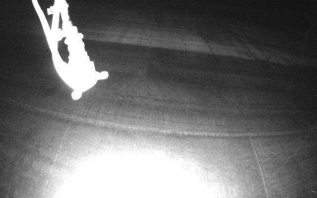
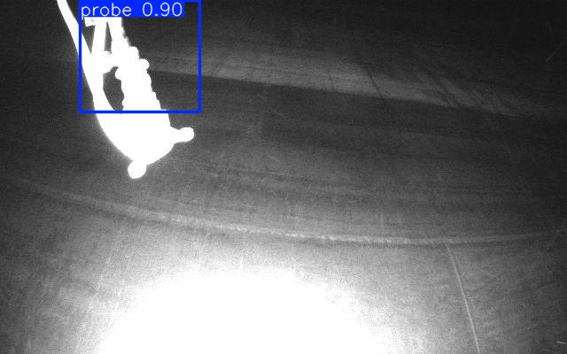

# 🚀 Probe Detection Using YOLOv8

This project implements a deep learning pipeline for detecting ultrasonic thickness measurement probes in drone-captured images. The system identifies bounding boxes around probes and notifies when no probe is detected. The model is fine-tuned from YOLOv8, ensuring optimal performance for probe detection tasks.

---

## Report Details

- **Author:** [Ermanno Fiorillo](https://www.linkedin.com/in/ermanno-fiorillo-799296171)
- **GitHub Repository:** [Flyability Probe Detection Project](https://github.com/ErmannoF00/Probe-Detection.git)

---

## Features and Visuals

### Dataset Description

- The dataset contains drone images with annotated ultrasonic probes.
  - **Images Folder:** `probe_dataset/probe_images`
  - **Annotations File:** `probe_dataset/probe_labels.json`

### Sample Outputs

- Below are examples of the system's output:
  - **Input Image:**
    
  - **Output with Detected Probes:**
    
  - **System Metrics:** Losses, Precision, Recall

---

## Folder Structure

The repository consists of the following main directories and files:

- **probe_dataset/**
  - Contains the raw dataset:
    - `probe_images/`: Raw drone-captured images.
    - `probe_labels.json`: JSON annotations for the bounding boxes of the probes.
  
- **processed_data/**
  - Created during preprocessing, it stores:
    - `train/`: Training dataset with images and YOLO-compatible labels.
    - `val/`: Validation dataset with images and YOLO-compatible labels.
    - `test/`: Testing dataset with images and YOLO-compatible labels.
    - `data.yaml`: YOLO configuration file for training.

- **runs/**
  - Results of training, validation, and testing:
    - `detect/train/weights/`: Saved model weights.
    - `detect/predict/`: Output images with bounding boxes drawn.
    - `detect/train/results.png`: Training metrics (losses, precision, recall, F1-score).

- **ProbeDetector_YOLO.py**
  - Core implementation of the pipeline: preprocessing, training, and evaluation.

---
##  Installation and Setup

- **Clone the repository**:
  ```bash
  git clone https://github.com/your-username/probe-detection-yolo.git
  cd probe-detection-yolo  
  ```
  
- **Install dependencies**:
  ```bash
  pip install -r requirements.txt  
  ```
- **Download Pretrained Weights**:
  Download the weights here and place them in the `detect/train/weights/` folder.

- **Run Training/Evaluation:**
  - To train:
    ```bash
     python ProbeDetector_YOLO.py --mode train --epochs 50 
     ```
  - To evaluate:
    ```bash
    python pipeline.py --mode evaluate --weights trained_weights/best.pt  
    ```

---
## Pipeline Overview

### 1] Preprocessing

- Parse the `probe_labels.json` to extract bounding boxes for each image.
- Split the dataset into training (70%), validation (15%), and testing (15%) subsets.
- Convert bounding box coordinates into YOLO format and create a `data.yaml` file for configuration.

### 2] Training
  - The pipeline uses YOLOv8 for probe detection. The training process involves:
  - **Model Architecture:** YOLOv8n (nano) for edge deployment.
  - **Hyperparameters:**
    - Image size: 640x640
    - Batch size: 16
    - Epochs: 50
- **Command:**
  ```bash
  python ProbeDetector_YOLO.py --mode train --epochs 50 --batch-size 16
  ```
  
### 3] Evaluation
- Evaluate the trained model using the test dataset:
  ```bash
  python ProbeDetector_YOLO.py --mode evaluate --weights runs/detect/train/weights/best.pt --subset test
  ```
Metrics: Precision, Recall, F1-score, IoU, and inference runtime are displayed in the terminal and saved in results.png.

---

### Class Overview

The `ProbeDetectorPipeline` class encapsulates all steps:

- **Data Parsing:** Extract annotations and match them to images.
- **Dataset Splitting:** Train, validation, and test dataset preparation.
- **Configuration:** YOLOv8 data file creation.
- **Training:** Model fine-tuning using YOLOv8.
- **Evaluation:** Inference on test images with metrics.

### Core Functions

- `parse_annotations`: Reads JSON and maps bounding boxes to images.
- `split_dataset`: Creates YOLO-compatible dataset splits.
- `create_config`: Generates `data.yaml` for YOLOv8.
- `train_model`: Fine-tunes YOLOv8 on the training data.
- `evaluate_model`: Evaluates the model and saves predictions.

---
## 🚩 Future Improvements

- **Edge Deployment:** Optimize YOLOv8 architecture for IoT devices (e.g., NVIDIA Jetson Nano).
- **Augmentation:** Enhance dataset with adversarial and environmental transformations.
- **Real-Time Inference:** Implement a faster inference engine for real-time processing.
---

## 🤝 Acknowledgments

Special thanks to [Flyability](https://www.flyability.com/company-page/) for providing this challenging and exciting project.
For any inquiries, connect with me on [LinkedIn](https://www.linkedin.com/in/ermanno-fiorillo-799296171). Check out the full implementation on GitHub.
