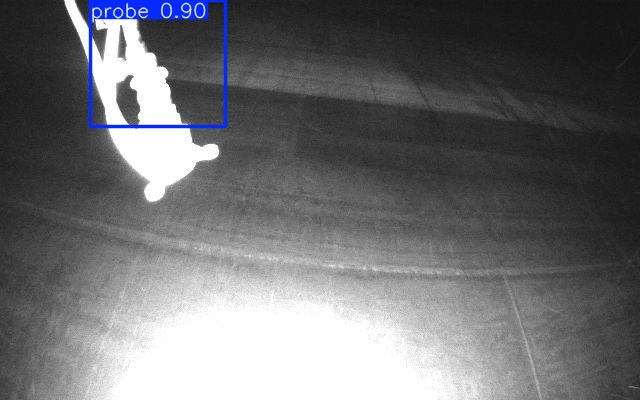

# Probe Detection Using YOLO

## Overview
This project implements a deep learning pipeline using YOLO to detect ultrasonic thickness measurement probes in drone images. The system identifies bounding boxes around probes and notifies if no probe is detected.

## Features
- **Data Handling:** Automated splitting of dataset into train, validation, and test sets.
- **YOLO Integration:** Fine-tuned YOLOv8 model for probe detection.
- **Visualization:** Qualitative evaluation using example outputs.

## Dataset
The dataset consists of:
- `probe_images/`: Folder containing raw images.
- `probe_labels.json`: JSON file containing bounding box annotations.

## Example Output
**Input Image:**


**Output with Detected Probe:**


## System Demo


## Installation
1. Clone the repository:
   ```bash
   git clone https://github.com/your-username/probe-detection-yolo.git
   cd probe-detection-yolo
Install dependencies:
bash
Copy code
pip install -r requirements.txt
Download the trained weights from this link and place them in the trained_weights/ folder.
Usage
Run the inference script:
bash
Copy code
python pipeline.py --mode evaluate --weights trained_weights/best.pt --subset test
Evaluation Metrics
Precision, Recall, F1-Score: Provide quantitative results here.
Inference Speed: Measured in FPS on NVIDIA Jetson Nano.
Future Improvements
Optimize YOLO architecture for deployment on edge devices like NVIDIA Jetson.
Augment dataset for better generalization across different environments.
Authors
Your Name – LinkedIn Profile

yaml
Copy code

---

### 4. **Uploading to GitHub**
1. Create a new repository on GitHub.
2. Push your project:
   ```bash
   git init
   git add .
   git commit -m "Initial commit for probe detection project"
   git branch -M main
   git remote add origin https://github.com/your-username/probe-detection-yolo.git
   git push -u origin main
By following these steps, your README will be visually rich, easy to understand, and the submission will meet the required standards.
